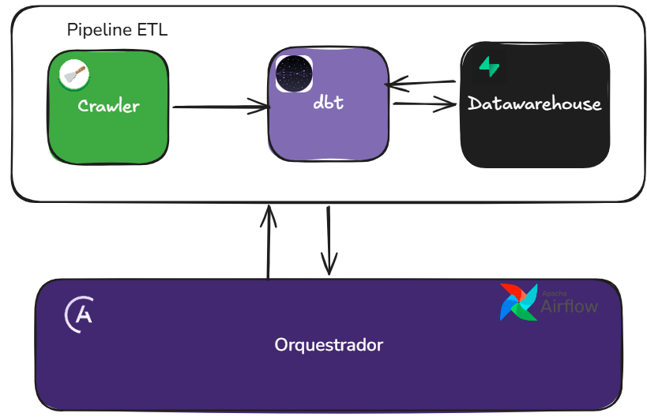

# 🏦  ETL de Ações e Fundos Imobiliários

<div align="center">
  
  
  
  
  
</div>

## 📋 Visão Geral

Pipeline para extração, análise e rankeamento de ativos financeiros (FIIs e Ações) com base em indicadores fundamentais.

## 🛠️ Tecnologias

- **Banco de Dados:** PostgreSQL
- **Orquestração:** Apache Airflow
- **ETL:** SQL, Pandas
- **Análise de Dados:** Pandas
- **Web Scraping:** Scrapy
- **Containerização:** Docker, Docker Compose

## 🏗️ Arquitetura ETL

O fluxo de ETL (Extração, Transformação e Carregamento) é orquestrado pelo Apache Airflow, garantindo a confiabilidade e rastreabilidade de todo o processo. A arquitetura segue o seguinte fluxo:

1. **Extração**
   - Utilização do Scrapy para coleta de dados de fontes financeiras
   - Dados brutos são armazenados temporariamente em formato estruturado

2. **Transformação**
   - Limpeza e normalização dos dados brutos
   - Cálculo de indicadores financeiros
   - Validação e tratamento de dados ausentes
   - Aplicação de regras de negócio

3. **Carregamento**
   - Criação automática de schemas e tabelas no PostgreSQL
   - Carga incremental dos dados processados
   - Manutenção de histórico para análise temporal



O Airflow gerencia todo o fluxo com DAGs (Directed Acyclic Graphs) que são agendadas e monitoradas, garantindo que cada etapa seja executada na ordem correta e com tratamento de falhas adequado.


## Requisitos

- Astronomer-cli - [Download](https://www.astronomer.io/docs/astro/cli/install-cli) 
- Docker - [Download](https://www.docker.com/get-started/) 

## Como usar

Clone o repositório em sua máquina local

```bash
git clone https://github.com/fabiolucasz/pipeline-acoes-airflow.git
```


## Executar pipelines com astronomer

- Entre na pasta airflow

```bash
cd airflow
```

- Execute o seguinte comando


```bash
astro dev start
```

- Crie as conexões com o seu banco de dados de desenvolvimento e produção

- Altere o nome das variáveis `conn_id` no arquivo `airflow/dags/dbt_dag.py` para os nomes das conexões que você criou

- Crie uma variável com o nome `dbt_env` e valor `dev` ou `prod` para alterar dinamicamente entre ambientes de desenvolvimento e produção.


## 📄 Licença

Distribuído sob a licença MIT. Veja `LICENSE` para mais informações.

## ✉️ Contato

Fabio Lucas - [LinkedIn](https://www.linkedin.com/in/fabiolucamz/)

Link do Projeto: [https://github.com/fabiolucasz/pipelina-acoes-airflow](https://github.com/fabiolucasz/pipeline-acoes-airflow)

## 📌 Agradecimentos

- [Django](https://www.djangoproject.com/)
- [Bootstrap](https://getbootstrap.com/)
- [Pandas](https://pandas.pydata.org/)
- [Scikit-learn](https://scikit-learn.org/)
- [Todos os contribuidores](../../contributors)
